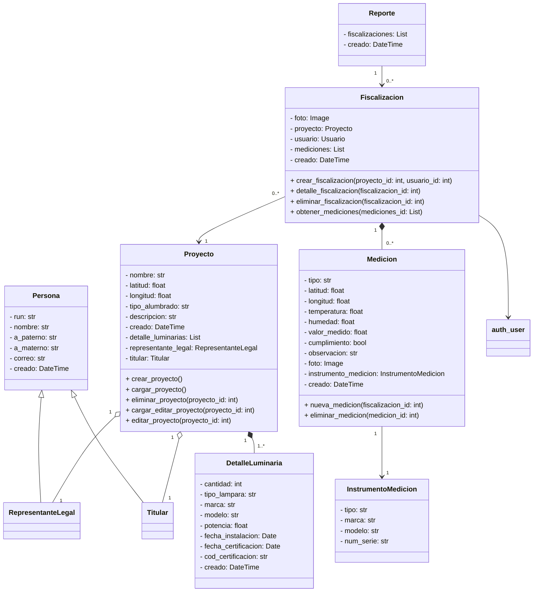

## Diagrama de Clases

:::mermaid
classDiagram
    class Persona {
        - run: str
        - nombre: str
        - a_paterno: str
        - a_materno: str
        - correo: str
        - creado: DateTime
    }

    class Titular {
        
    }

    class RepresentanteLegal {
        
    }

    class auth_user {
        
    }

    class Proyecto {
        - nombre: str
        - latitud: float
        - longitud: float
        - tipo_alumbrado: str
        - descripcion: str
        - creado: DateTime
        - detalle_luminarias: List<DetalleLuminaria>
        - representante_legal: RepresentanteLegal
        - titular: Titular
        + crear_proyecto()
        + cargar_proyecto()
        + eliminar_proyecto(proyecto_id: int)
        + cargar_editar_proyecto(proyecto_id: int)
        + editar_proyecto(proyecto_id: int)
    }

    class DetalleLuminaria {
        - cantidad: int
        - tipo_lampara: str
        - marca: str
        - modelo: str
        - potencia: float
        - fecha_instalacion: Date
        - fecha_certificacion: Date
        - cod_certificacion: str
        - creado: DateTime
    }

    class Fiscalizacion {
        - foto: Image
        - proyecto: Proyecto
        - usuario: Usuario
        - mediciones: List<Medicion>
        - creado: DateTime
        + crear_fiscalizacion(proyecto_id: int, usuario_id: int)
        + detalle_fiscalizacion(fiscalizacion_id: int)
        + eliminar_fiscalizacion(fiscalizacion_id: int)
        + obtener_mediciones(mediciones_id: List<Medicion>)
    }

    class Medicion {
        - tipo: str
        - latitud: float
        - longitud: float
        - temperatura: float
        - humedad: float
        - valor_medido: float
        - cumplimiento: bool
        - observacion: str
        - foto: Image
        - instrumento_medicion: InstrumentoMedicion
        - creado: DateTime
        + nueva_medicion(fiscalizacion_id: int)
        + eliminar_medicion(medicion_id: int)
    }

    class InstrumentoMedicion {
        - tipo: str
        - marca: str
        - modelo: str
        - num_serie: str
    }

    class Reporte {
        - fiscalizaciones: List<Fiscalizacion>
        - creado: DateTime
    }

    Persona <|-- Titular
    Persona <|-- RepresentanteLegal
    Titular "1" --o "0..*" Proyecto
    RepresentanteLegal "1" --o "0..*" Proyecto
    Proyecto "1" --o "0..*" Fiscalizacion
    Proyecto "1" --o "1..*" DetalleLuminaria
    Fiscalizacion "1" *-- "0..*" Medicion
    Fiscalizacion "0..*" --o "1" Reporte
    Fiscalizacion "0..*" --> "1" auth_user
    Medicion "1" --o "1" InstrumentoMedicion
:::